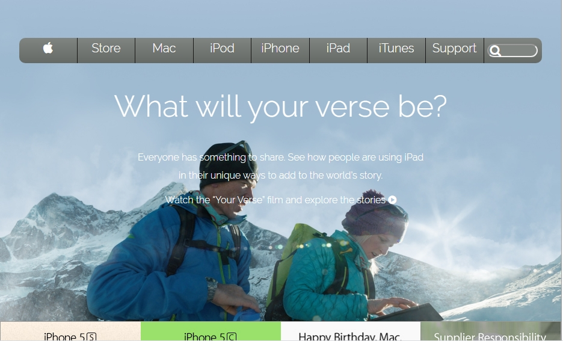

# apple-clone

> This project consists of building an HTML document that matches the appearance of [mint.com’s](Apple's Page) 

## Built With

- HTML,
- CSS

## Getting Started

To test the code please clone the repository [here](https://github.com/haraphat01/apple-clone)

Run the index file with Google Chrome Browser

### Prerequisites

HTML5 and CSS3 compatible browser

### Deployment

You can use [raw githack](https://raw.githack.com/) to view this page directly from github.

You can view the site itself [here](https://raw.githack.com/haraphat01/apple-clone/apple-feature/index.html) .Have fun!

## Author

👤 **Arafat Akata**

- Github: [@haraphat01](https://github.com/haraphat01)

## 🤝 Contributing

Contributions, issues and feature requests are welcome!

Feel free to check the [issues page](issues/).

## Show your support

Give a ⭐️ if you like this project!

## Acknowledgments

- Microverse

## 📝 License

This project is [MIT](lic.url) licensed.
